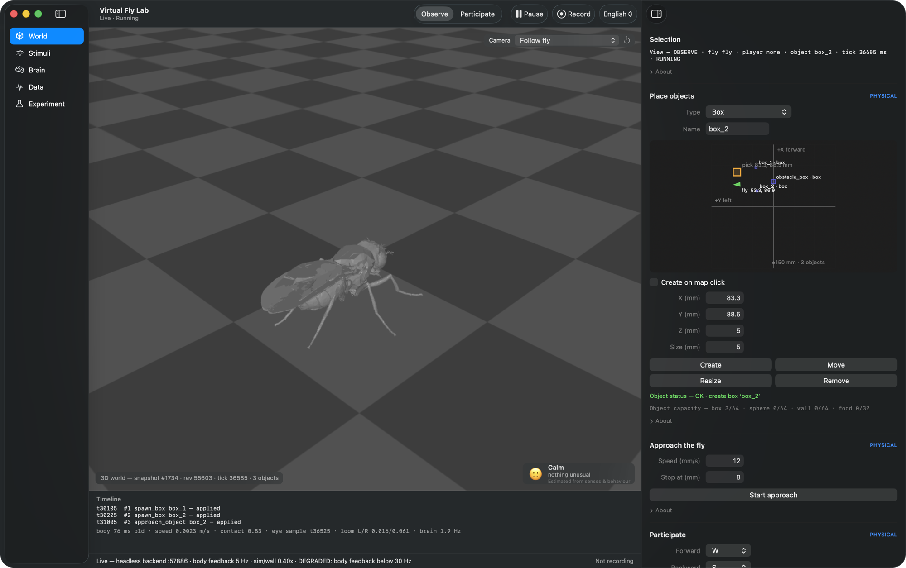
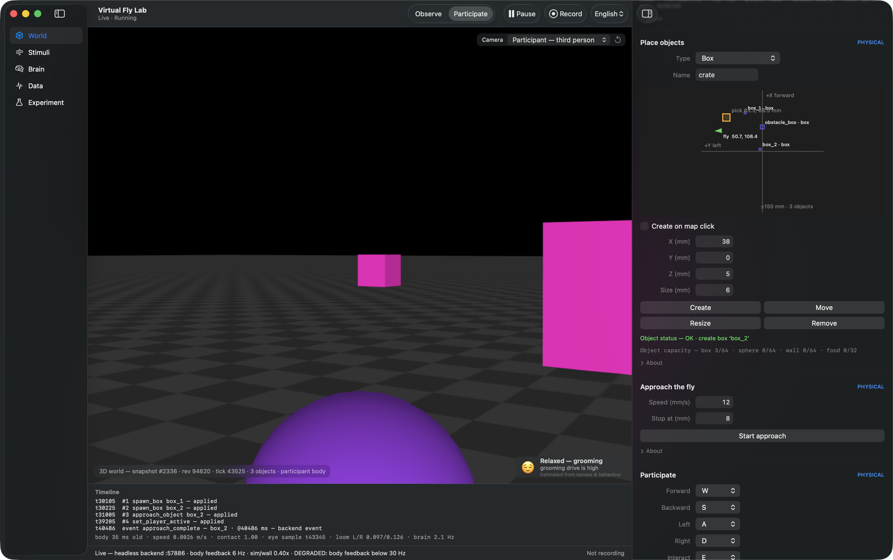
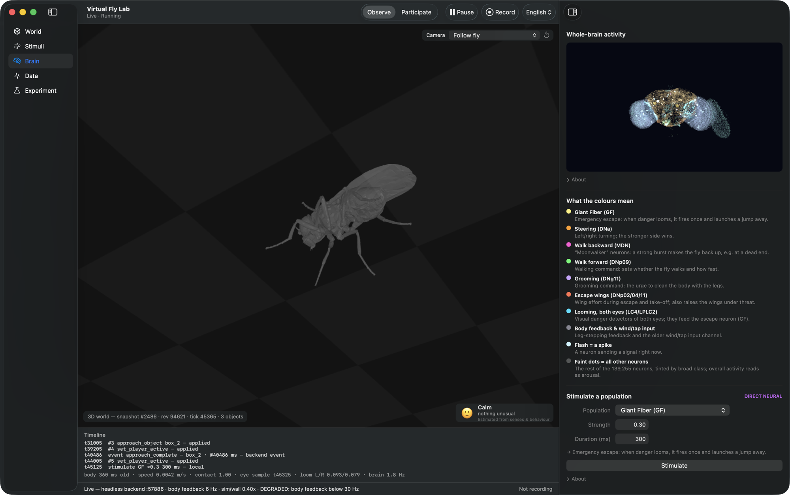
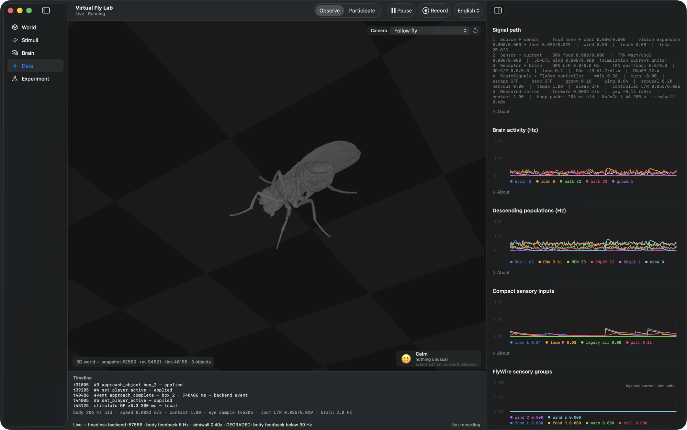
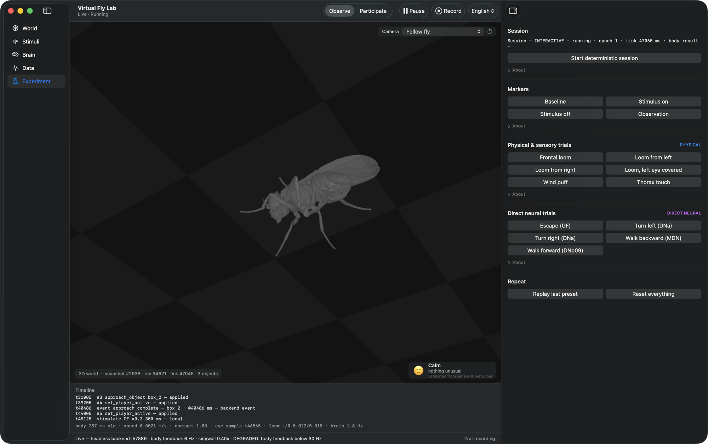
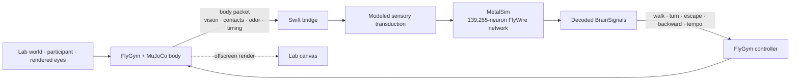

# Thongpari Fly Neuron Sim

<p align="center">
  <strong>A connectome-driven virtual fruit-fly laboratory for macOS.</strong><br>
  The whole FlyWire brain simulated on the GPU, driving a real NeuroMechFly body in MuJoCo — and you can walk into its world.
</p>

<p align="center">
  
  
  
  
</p>

<p align="center">
  
</p>
<p align="center"><sub>The one-window Lab on an M2 MacBook Air, real FlyGym backend. The canvas is MuJoCo's own offscreen render of the NeuroMechFly v2 body; the inspector places physical objects on a top-down map.</sub></p>

**Thongpari Fly Neuron Sim** grew out of the SiliconFly desktop fly into an interactive **virtual fly lab**:

- **Brain** — the shipped FlyWire v783 connectome as a **139,255-neuron, 15,091,983-edge** leaky-integrate-and-fire network at 1 kHz in a Metal compute shader.
- **Body** — a real **NeuroMechFly v2** model in **FlyGym 2.1 / MuJoCo**, not a scripted animation.
- **Closed loop** — descending-neuron activity drives the FlyGym walking controller; measured body state, rendered-eye vision, contacts, odor, wind and temperature flow back into identified neural populations.
- **You** — a participant body in the same MuJoCo world: walk with WASD, look with the mouse, and pick up and carry objects.

The point is not to fake convincing animal behavior. Every response can be traced along **source → modeled sensor → receptor activity → brain output → controller → measured motion**, and every control says whether it is physical, a sensory model, or direct neural stimulation.

---

## Tour

<table>
  <tr>
    <td width="50%"></td>
    <td width="50%"></td>
  </tr>
  <tr>
    <td><b>Participate</b> — a free-joint body that collides with the fly and objects. Walk, look, grab and place from first- or third-person cameras.</td>
    <td><b>Brain</b> — the whole-brain point cloud with live spike flashes, what each colour means, and direct stimulation of named populations.</td>
  </tr>
  <tr>
    <td></td>
    <td></td>
  </tr>
  <tr>
    <td><b>Data</b> — the signal path line by line, plus live graphs of brain activity, descending populations and sensory drive.</td>
    <td><b>Experiment</b> — deterministic sessions, trial markers, preset physical/sensory and direct-neural trials, CSV recording.</td>
  </tr>
</table>

---

## Status

**V5.6.1 is complete (2026-09-27).** Next on the [roadmap](docs/plans/VIRTUAL_FLY_LAB_ROADMAP.md) is **V5.7** — read-only activity cards built from the telemetry that already exists (no invented hunger/emotion values).

| Version | What it added |
|---|---|
| V2 | Closed-loop lab: rendered-eye vision, odor, wind, touch, temperature, presets, recording |
| V3 | Stabilized loop; `SensoryModel` / `MotorReadout` boundaries with frozen V2 oracles |
| V4 | Deterministic sessions: 1 ms neural ticks, exact 20 ms brain/body quanta, pause barriers |
| V5.1–V5.5 | Atomic 3D snapshots and ray picking, Observe/Participate, cameras, a real participant body, WASD / mouse-look input with strict wire validation |
| V5.5.1 | One window: sidebar, MuJoCo canvas, inspector; app-owned headless backend; English/Korean |
| V5.6 | Grab and place: aim, press E to pick up an object, E again to put it down |
| **V5.6.1** | Carry and input feel: constrained carry (below), latest-frame video, look-sensitivity slider, pointer lock, test-code refactor |

Per-version evidence lives in [`docs/reports/V5_PROGRESS.md`](docs/reports/V5_PROGRESS.md) and [`notes/validation/`](notes/validation/v5-6-1-2026-09-27/README.md).

---

## The lab

The Lab is a single standard macOS window: a toolbar (**Observe / Participate**, pause, record, language), a source-list sidebar, the live world canvas with a timeline and status line beneath it, and an inspector that follows the sidebar. Changing the sidebar page never moves the camera or drops the selection.

| Page | What you can do |
|---|---|
| **World** | Place, move, resize and remove boxes, spheres, walls and food sources (fields or click-on-map); make an object approach the fly; participant key bindings and look sensitivity; resets |
| **Stimuli** | Cover or flash either eye, wind (physical force and/or modeled antennal drive), touch thorax/head/abdomen/legs, temperature mode |
| **Brain** | Whole-brain point cloud, neuron selection, direct stimulation of GF, DNa, MDN, DNp09, DNg11, LC4/LPLC2 and the exposed receptor groups |
| **Data** | Source state, receptor drive and spike rates, decoded `BrainSignals`, controller output, packet age, sim/wall timing, measured motion |
| **Experiment** | Deterministic session, markers, looming/wind/touch/direct-neural presets, replay, recording |

Every control is labeled with the kind of intervention it is:

- **PHYSICAL** — real MuJoCo geometry or force.
- **SENSORY-MODEL** — an explicit engineering transduction into identified neural populations.
- **DIRECT-NEURAL** — current injection that bypasses sensory transduction.

A physical touch on the left front leg is a body-specific MuJoCo event; the neural touch path is a **generic modeled startle channel**. The UI never presents those as the same thing.

### Participate: walk, look, grab, place

Choose **Participate**, then click the 3D view to take control. The cursor hides and stays put so mouse-look keeps working past the window edge.

| Input | Action |
|---|---|
| **W A S D** | walk (remappable on the World page) |
| **Mouse** | look; speed on the **Look sensitivity** slider (default 0.0015 rad/pt, saved) |
| **E** | grab the object under the center mark (within 12 mm); press again to place it |
| **Esc** | release control; focus loss, mode change and window close release it too |

Movement is integrated in **simulation time**, not frame rate or key repeat. Mouse-look deltas are applied exactly once however the OS splits the events.

**Carrying** is kinematic and XY-only at up to 40 mm/s, held just in front of where you look. Since V5.6.1 each 0.1 ms physics substep is constrained *before* it is taken: MuJoCo's signed distance and witness points give the surface normal and remaining gap to nearby objects and to your own body, and the step keeps only what every surface allows. A held box therefore slides along walls and swings around you instead of pushing into you. It keeps 0.5 mm from the participant and stops 0.005 mm short of other objects. The older approaches — straight chase, polar sweep, tangent slide — each shoved the participant (up to 32.5 mm) or stuck against walls in real-MuJoCo tests. A post-step guard still reverts any step that deepens a penetration.

---

## Closed-loop architecture



- Swift owns the brain (Metal) and the UI.
- Python owns the body, world and participant physics (FlyGym / MuJoCo).
- They talk NDJSON over a loopback socket with session/epoch/tick stamps, bounded queues and freshness checks. Stale body feedback is rejected, never replayed as current sensory state.
- The canvas shows MuJoCo's own render of the same `MjModel`/`MjData`, the physics thread only updates the scene and the GPU render runs on its own thread (rendering on the physics thread had cut body rate from 24 to 12–17 Hz).

---

## What you can test

- **Vision and looming** — real left/right FlyGym eye renders; brightness, occupancy and a generic optic-expansion estimate. Regression tests reject contraction, camera pan and full-field flash as false looms.
- **Food / odor** — food sources are physical markers with a modeled odor plume. Concentration from source geometry and fly pose is split bilaterally into FlyWire `ORN_DM1` + `ORN_VA2`. No taste, reward or scripted food-seeking.
- **Wind** — independently a physical force on the thorax and/or modeled drive into `JO-C*` / `JO-E*`.
- **Touch** — a real impulse to the thorax, head, abdomen or any named leg; the neural side is a labeled generic startle channel.
- **Temperature** — `environment_only`, `modeled_physiology` (locomotor tempo through the real controller), or `flywire_sensory` (`TRN_VP2`, `TRN_VP3a`, `TRN_VP3b`).
- **Direct neural** — stimulate a named population and watch what the body does with it.

---

## Quick start

**Requirements:** an Apple Silicon Mac, Xcode Command Line Tools (Swift), Python 3.12, and FlyGym 2.1.0 with its MuJoCo dependencies.

```sh
git clone https://github.com/parkjaeyoungcovid19-hue/thongpari-fly-neuron-sim.git
cd thongpari-fly-neuron-sim
./build.sh

/opt/homebrew/opt/python@3.12/bin/python3.12 -m venv flygym-venv
./flygym-venv/bin/pip install -r flygym_bridge/requirements.txt
```

Launch the Lab by double-clicking **`Virtual Fly Lab.command`** in Finder, or:

```sh
./run_flygym.sh
```

The launcher rebuilds when a Swift source is newer than the binary, then runs `./ThongpariFlyNeuronSim --lab`. The app starts its own headless FlyGym/MuJoCo backend on a private loopback port, shows it in the one window and stops it on quit. The backend also exits by itself if the app dies. A cold start takes a while to prewarm, and the window shows progress until it is ready.

| Command | Use |
|---|---|
| `./package_app.sh` | build `dist/Thongpari Virtual Fly Lab.app` from this checkout |
| `./run_flygym.sh --mock` | kinematic mock body, no MuJoCo — quick UI checks |
| `./run_flygym.sh --viewer` | development only: also opens MuJoCo's own viewer |
| `./run_flygym.sh --bridge-only` | just a headless bridge on `127.0.0.1:17841` for the TCP diagnostics |
| `./ThongpariFlyNeuronSim` | the original desktop-overlay fly with its brain window |

If macOS "Optimize Mac Storage" has offloaded `flygym-venv` to iCloud, the first backend start downloads each Python file on demand and can take many minutes. Keep the project folder downloaded.

**Performance.** On the 8 GB M2 MacBook Air in the screenshots, the full real body with the render stream ran at about **0.4× real time**. The status line flags it as `DEGRADED: body feedback below 30 Hz` rather than hiding it. The V3-era launcher run with MuJoCo's separate viewer measured ~0.8×. These are machine-specific observations, not benchmarks.

---

## Recording experiments

```text
~/Documents/ThongpariFlyNeuronSimExperiments/experiment-YYYYMMDD-HHMMSS/
├── metadata.json
├── events.jsonl
└── telemetry.csv
```

Telemetry includes neural rates, modeled sensory drive, receptor spike rates, decoded brain state, controller output, body velocity and contacts, vision values, packet age and simulation timing. `Baseline`, `Stimulus ON/OFF` and `Observation` markers make repeated trials comparable.

---

## Testing

Self-tests are built into the binary; Python tests run against the mock and the real MuJoCo body.

```sh
./build.sh
./ThongpariFlyNeuronSim --labtest        # lab protocol, input, frame hand-off
./ThongpariFlyNeuronSim --bridgetest     # wire contract and decoders
./ThongpariFlyNeuronSim --v4test         # deterministic sessions
./ThongpariFlyNeuronSim --v4timingtest
./ThongpariFlyNeuronSim --simtest        # circuit invariants + GPU throughput
./ThongpariFlyNeuronSim --behaviortest   # sim -> body end to end
./ThongpariFlyNeuronSim --gpucheck       # GPU vs an independent CPU reference

./flygym-venv/bin/python flygym_bridge/test_interaction_real.py   # grab / carry in real MuJoCo
./flygym-venv/bin/python flygym_bridge/test_player_collision_real.py
./flygym-venv/bin/python flygym_bridge/test_lab_real.py
```

Against a fresh backend (`./run_flygym.sh --bridge-only`, or `bridge.py --mock`), `--bridgeloop`, `--labloop`, `--v4loop` and `--interactionloop` exercise the real TCP path. `--inputprobe` measures input latency and look cadence, and exits non-zero if its preconditions fail.

Latest full run (V5.6.1, 2026-09-27): **10/10 Python suites, 7/7 Swift self-tests, 7/7 TCP runs** (mock and real headless) passed. The carry scenarios hold the participant still across the whole path (0.0000 mm) and have negative controls. Details: [V5.6.1 validation](notes/validation/v5-6-1-2026-09-27/README.md).

---

## What is measured, what is modeled

**Grounded in data or runtime state:** FlyWire v783 identities and connectivity; FlyGym/MuJoCo body state and contacts; rendered eye frames; bridge timing and controller output; the spikes the simulation actually produces after an input is injected.

**Engineering assumptions:** odor → current gain; temperature → TRN current; wind → JO-C/E current; the generic touch/startle channel; the optic-expansion estimator; the descending-neuron → locomotor-controller mapping.

Use it for **controlled comparisons inside the same model**, not as a claim that every intermediate quantity is a measured biological transfer function.

---

## Repository map

```text
.
├── Virtual Fly Lab.command        Finder launcher (runs run_flygym.sh)
├── run_flygym.sh / package_app.sh CLI launcher / app bundle builder
├── main.swift                     launch modes, Coordinator (brain ↔ body loop), AppDelegate
├── MetalSim.swift, LIF.metal      GPU FlyWire spiking simulation
├── SensoryModel.swift             modeled source → receptor drive
├── MotorReadout.swift             population rates → BrainSignals
├── FlyGymService.swift            app-owned backend process on a private port
├── FlyGymBridge.swift             TCP transport, queues, connection lifecycle
├── FlyGymPackets.swift, LabProtocol.swift   wire packets and lab telemetry types
├── LabWindow.swift, LabChrome.swift         the Lab window, sidebar, inspector pages
├── WorldViewer.swift, MuJoCoCanvas.swift    3D canvas: camera, picking, participate input, MuJoCo frames
├── PlayerController.swift         WASD / mouse-look / focus / remap / look sensitivity
├── BrainView.swift                139k-neuron point cloud (Brain page)
├── ExperimentRecorder.swift       events + CSV recording
├── LabLocalization.swift          English / Korean strings
├── LabDiagnostics.swift           --labtest
├── SimDiagnostics.swift           --simtest / --behaviortest / --v4timingtest
├── BridgeDiagnostics.swift        --bridgetest and the live TCP loops, --inputprobe
├── flygym_bridge/
│   ├── bridge.py                  Python server (sessions, commands, input, snapshots)
│   ├── fly_body.py                mock + real FlyGym body
│   ├── lab_world.py               world objects, stimuli, carry constraints
│   ├── interaction.py             grab / place contract and constrained carry step
│   ├── player_body.py             participant physics and movement
│   ├── view_stream.py             MuJoCo offscreen render stream for the canvas
│   ├── vision_decoder.py          rendered-eye decoder
│   └── test_*.py                  Python regression suite
├── data/                          FlyWire v783 connectome (~95 MB, CC BY-NC 4.0)
└── docs/                          guides, plans + roadmap, reports, reference
```

Controls and preset values: **[Virtual Fly Lab guide](docs/guides/VIRTUAL_FLY_LAB_GUIDE.md)**. Bridge internals and protocol: **[flygym_bridge/README.md](flygym_bridge/README.md)**. The **[V4–V14 roadmap](docs/plans/VIRTUAL_FLY_LAB_ROADMAP.md)** is implemented strictly in order; V6–V14 remain planned.

---

## Upstream work and credits

This repository started from **[SiliconFly](https://github.com/dawsonamf/siliconfly)** by Dawson Metzger-Fleetwood, which credits **[DesktopFly](https://github.com/DenisSergeevitch/desktop-fly)** by Denis Shiryaev for the original desktop fly. It also builds on:

- **[FlyWire](https://codex.flywire.ai/)** connectome data;
- **[FlyGym / NeuroMechFly v2](https://neuromechfly.org/)** by the Ramdya Lab, EPFL;
- **[MuJoCo](https://mujoco.org/)** for physics and rendering.

Please cite the relevant upstream projects and papers when using their data or models in research.

<p align="center">
  
  
</p>

- `docs/images/neuromechfly-v2.jpg` — simulated NeuroMechFly v2 scene, **Ramdya laboratory, EPFL**, **CC BY-SA 4.0**: <https://actu.epfl.ch/news/simulating-how-fruit-flies-see-smell-and-navigat-4>.
- `docs/images/drosophila-melanogaster.jpg` — *Drosophila melanogaster* by **Alexis** (`alexis_orion` on iNaturalist), **CC BY 4.0**, Wikimedia Commons: <https://commons.wikimedia.org/wiki/File:Drosophila_melanogaster_53362116.jpg>.
- `docs/images/ui-*.png` — screenshots of this app, captured 2026-09-27.

---

## License

Source code is MIT-licensed; see [LICENSE](LICENSE). Connectome-derived data under `data/` is licensed separately (CC BY-NC 4.0); see `data/DATA_LICENSE.md`.
