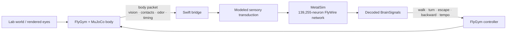

# Thongpari Fly Neuron Sim

<p align="center">
  <strong>A connectome-driven virtual fruit-fly laboratory for macOS.</strong><br>
  FlyWire whole-brain simulation in Metal, coupled in closed loop to a FlyGym / NeuroMechFly body in MuJoCo.
</p>

<p align="center">
  
  
  
  
</p>

<p align="center">
  
</p>

<p align="center">
  
</p>

<p align="center"><sub>Actual Virtual Fly Lab V2 GUI running on macOS; the documentation capture uses the mock bridge for stable telemetry.</sub></p>

**Thongpari Fly Neuron Sim** turns the original SiliconFly desktop fly into an interactive **virtual fly lab**. The brain side runs the shipped FlyWire v783 connectome as a 139,255-neuron spiking network on the GPU. The body side runs a real NeuroMechFly v2 model in FlyGym / MuJoCo. A bidirectional bridge connects neural outputs to locomotion and sends measured body, vision, contact and environmental state back into the neural simulation.

The goal is not to fake convincing animal behavior. The V2 feature set is preserved through the later architecture so that you can see where a response came from: **source → modeled sensor → receptor activity → brain output → controller → measured motion**. V3 stabilized that loop, V4 added deterministic session/tick ownership, and V5 is building a participant-facing 3D lab on top of the same authoritative backend.

### Current V5 status

V5.1–V5.5.1 are now implemented in the repository. V5.1–V5.5 add a backend-owned participant body and deterministic player input without moving authority into the Swift renderer; V5.5.1 gathers everything into one macOS window:

- **V5.1** — read-only SceneKit 3D viewport driven by atomic backend snapshots, plus authoritative ray picking;
- **V5.2** — shared Observe / Participate screen state and common selection/session state;
- **V5.3** — orbit/follow/free presentation cameras plus eye-render simulation-tick provenance;
- **V5.4** — a real free-joint participant body compiled into the same MuJoCo world as the fly and LabObjects, including real collision and rendered-eye visibility;
- **V5.5** — WASD movement, mouse look, E held-action state and Esc safety release, with focus-safe capture, persistent key remapping, strict Swift/Python PlayerInput wire validation, deterministic requested-tick scheduling, replay/idempotency protection and disconnect neutralization.

- **V5.5.1** — one-window app: the Lab is the only window, with a source-list sidebar, an always-visible world canvas that shows MuJoCo's own offscreen rendering of the real NeuroMechFly body, and an inspector that follows the sidebar. The app owns a headless real FlyGym backend on a private loopback port; no MuJoCo viewer, floating brain panel or desktop overlay opens. The 3D brain point cloud moved into the Brain page. Adds English/Korean interface language, a Finder launcher and an app bundle.

V5.5 movement is integrated from **simulation time**, not render FPS or key-repeat rate. Mouse-look deltas are kept raw and accumulated exactly once; the same total pointer motion gives the same rotation however the OS partitions the events, and deltas above the per-packet bound are split into valid packets rather than clipped. Esc, focus loss, mode exit, capability loss and reconnect discard stale held state and any unsent look remainder before a neutral packet is sent; ordinary key-up also sends its neutral state even when the render snapshot is stale.

**Next: V5.6 grab/place.** V5.5.1 is complete as of 2026-09-26 ([completion report](docs/reports/V5_5_1_COMPLETION_REPORT.md)): the participant wall-collision blocker (audit F-02) is fixed and the GUI flows are accepted. The V5.6 preflight is in [V5 progress](docs/reports/V5_PROGRESS.md).

---

## V2 feature set preserved in V3

| Layer | Current V2 implementation |
|---|---|
| Brain | 139,255 FlyWire neurons, 15,091,983 signed edges, 1 kHz LIF simulation in Metal |
| Body | FlyGym 2.1 / NeuroMechFly v2 / MuJoCo with real body dynamics and contact feedback |
| Closed loop | Swift ↔ Python NDJSON bridge with freshness, timing, reconnect and bounded queues |
| Vision | Real left/right FlyGym eye renders, brightness/occupancy and generic optic-expansion decoding |
| Olfaction | Food-source geometry → bilateral modeled odor → FlyWire `ORN_DM1` + `ORN_VA2` |
| Wind | Physical thorax force plus modeled `JO-C*` / `JO-E*` neural drive |
| Temperature | Environment-only, locomotor-tempo model, or FlyWire `TRN_VP2` / `TRN_VP3a+b` drive |
| Touch | Physical body-part impulse plus a separately labeled generic neural startle/touch channel |
| Experiments | Presets, direct neural stimulation, live graphs, markers and CSV/event recording |

---

## The lab

Since V5.5.1 the Lab is a single standard macOS window: a toolbar (Observe / Participate, run / pause, record, language), a source-list sidebar, the live 3D world canvas in the middle with an event timeline and status line beneath it, and an inspector on the right. Choosing a sidebar item changes only the inspector; the canvas, its camera and the current selection stay as they are. The sidebar is organized around five jobs rather than around implementation details:

**World** — spawn and move boxes, spheres, walls and food markers (including a small top-down placement map); approach objects toward the fly; reset the world or body.

**Stimuli** — cover either eye, flash an eye, apply wind, touch the thorax/head/abdomen/legs, and change temperature mode.

**Brain** — the 139,255-neuron 3D point cloud with spike flashes and neuron selection, plus direct stimulation of selected populations such as GF, DNa, MDN, DNp09, DNg11, LC4/LPLC2 and the currently exposed sensory receptor groups.

**Data** — inspect source state, receptor drive/spike rates, decoded `BrainSignals`, left/right controller output, packet age, sim/wall timing and measured body motion.

**Experiment** — run built-in looming/wind/touch/direct-neural presets, add trial markers, replay the previous preset and record telemetry to disk.

The UI deliberately separates three kinds of intervention:

- **PHYSICAL** — real MuJoCo geometry or force.
- **SENSORY-MODEL** — an explicit engineering transduction into identified neural populations.
- **DIRECT-NEURAL** — current injection that bypasses the sensory transduction step.

That distinction matters: a physical touch to the left front leg is a body-specific MuJoCo event, while the current V2 neural touch path is only a **generic modeled startle/touch channel**. The UI does not present those as the same thing.

---

## Closed-loop architecture



The bridge does not substitute a procedural translation for real FlyGym locomotion. In real-body mode the physical motion comes from the FlyGym controller and MuJoCo simulation. Stale body feedback is rejected rather than silently replayed as current sensory state.

---

## What you can test

### Vision and looming

The fly uses FlyGym's rendered left/right eye frames. V2 measures brightness and occupancy and also estimates outward edge motion from the raw frames after compensating for small whole-frame translation. The generic optic-expansion estimator is useful for arbitrary rendered objects; it is an **engineering approximation**, not a biological reconstruction of retinal motion processing.

Regression tests explicitly suppress common false loom cases including contraction, camera pan and full-field flash. Covering and reopening either eye is also tested through the real rendered path.

### Food / odor

Food markers are physical scene markers with a modeled odor source. Concentration is computed from source geometry and fly pose, split bilaterally, then injected into identified FlyWire `ORN_DM1` + `ORN_VA2` populations. Removing the source or receiving stale body feedback clears the drive.

There is intentionally **no taste, reward, feeding, or scripted food-seeking behavior** in V2.

### Wind

Wind can independently enable:

- a physical force on the MuJoCo thorax;
- a modeled sensory path into outgoing `JO-C*` / `JO-E*` populations.

The wind direction → neural current mapping is a model assumption, not a measured antennal transfer function.

### Touch

Touch can apply a real impulse to the thorax, head, abdomen, or any named leg. The current neural side is deliberately labeled as a generic modeled startle/touch channel rather than body-part-specific tactile physiology.

### Temperature

V2 exposes three modes:

- `environment_only` — records temperature; no neural input;
- `modeled_physiology` — adjusts locomotor tempo through the real FlyGym controller;
- `flywire_sensory` — drives identified warm/cool FlyWire populations (`TRN_VP2`, `TRN_VP3a`, `TRN_VP3b`).

---

## Quick start

### Requirements

- Apple Silicon Mac
- Xcode Command Line Tools / Swift toolchain
- Python 3.12
- FlyGym 2.1.0 and its MuJoCo dependencies

### 1. Clone and build

```sh
git clone https://github.com/parkjaeyoungcovid19-hue/thongpari-fly-neuron-sim.git
cd thongpari-fly-neuron-sim
./build.sh
```

### 2. Create the FlyGym environment

```sh
/opt/homebrew/opt/python@3.12/bin/python3.12 -m venv flygym-venv
./flygym-venv/bin/pip install -r flygym_bridge/requirements.txt
```

If your Python 3.12 lives somewhere else, use that interpreter instead.

### 3. Launch the lab

From Finder, double-click this file in the repository root:

```text
Virtual Fly Lab.command
```

CLI equivalent:

```sh
./run_flygym.sh
```

This rebuilds the app if any Swift source is newer than the binary, then runs `./ThongpariFlyNeuronSim --lab`. The app starts its own real FlyGym / MuJoCo backend headless on a private loopback port, shows it inside the one Lab window, and stops it on quit. The backend also exits by itself if the app dies. A cold backend start can take a while to prewarm; the window shows progress until the backend is ready.

To build a Finder app bundle that uses this checkout (`dist/Thongpari Virtual Fly Lab.app`):

```sh
./package_app.sh
```

Other launch modes:

| Command | Use |
|---|---|
| `./run_flygym.sh --mock` | kinematic mock body, no MuJoCo — quick UI checks |
| `./run_flygym.sh --viewer` | development only: also opens MuJoCo's own viewer window |
| `./run_flygym.sh --bridge-only` | only a real headless bridge on `127.0.0.1:17841`, for `--labloop` / `--v4loop` or `./ThongpariFlyNeuronSim --flygym` (Lab against that external bridge) |
| `./ThongpariFlyNeuronSim` | the original desktop-overlay fly with its floating brain window |

If macOS "Optimize Mac Storage" has offloaded `flygym-venv` to iCloud, the first backend start downloads each Python file on demand and can take many minutes. Keep the project folder downloaded.

---

## Recording experiments

The Lab can record trials under:

```text
~/Documents/ThongpariFlyNeuronSimExperiments/experiment-YYYYMMDD-HHMMSS/
├── metadata.json
├── events.jsonl
└── telemetry.csv
```

Telemetry includes neural rates, modeled sensory drive, receptor EMA spike rates, decoded brain state, controller output, body velocity/contact state, vision values, body packet age and simulation timing. `Baseline`, `Stimulus ON`, `Stimulus OFF`, and `Observation` markers make repeated trials easier to compare later.

---

## Validation status

### V5.5.1 one-window app status — 2026-09-26

V5.5.1 is **complete** ([completion report](docs/reports/V5_5_1_COMPLETION_REPORT.md)). The table below is the independent check on commit `ce1105c`, updated with the 2026-09-26 fixes; it is recorded in [`notes/validation/v5-5-1-independent-2026-09-26/`](notes/validation/v5-5-1-independent-2026-09-26/README.md).

| Gate | Result |
|---|---|
| Build + Swift suite (`--bridgetest --labtest --v4test --v4timingtest --simtest --behaviortest --gpucheck`) | all pass |
| Python suite (`test_bridge`, `test_lab`, `test_v4`, `test_v5`, real-MuJoCo `test_lab_real`, `test_vision_real`) | all pass |
| TCP loops, each on a fresh backend (mock bridge/lab/v4 loop, real-headless lab/v4 loop) | 5 / 5 pass |
| App bundle launch | one visible window (`Virtual Fly Lab`), backend on a private port, no MuJoCo/brain/overlay window; normal Quit and a killed app both leave no backend process |
| Mouse-look partitioning (audit F-03) | fixed: one 100 pt event and ten 10 pt events both give −0.40 rad |
| Key-up with a stale snapshot (audit F-01) | fixed; a refused send is re-sent from the 10 Hz refresh while Participate is running |
| Participant wall collision (audit F-02) | fixed — per-substep bounded force servo; peak penetration 0.025 mm (was 4.5 mm), rests at the surface after release; `test_player_collision_real.py` 18/18 ([evidence](notes/validation/f02-fix-2026-09-26/README.md)) |
| Integrated GUI flows 1–7 and GUI performance (plan §7) | accepted — flows 1–3 checked by Claude on the live window ([evidence](notes/validation/v5-5-1-gui-2026-09-26/README.md)), flows 4–7 and performance confirmed by the user; baseline latency numbers were not recorded |

GUI acceptance also fixed four defects: a frozen interactive session tick, unrecorded brain-click stimulation, a first-person eye that entered walls, and Participate capturing input before a 3D-view click.

### V5.5 participant input status — 2026-09-22

V5.5 is **automated + real-backend verified** in commit `f6c4c92` (`Implement Virtual Fly Lab V5.5 player input`). The implementation keeps player pose and motion authoritative in Python/MuJoCo while Swift supplies bounded, session-stamped input intent.

Key verified properties:

- strict PlayerInput / PlayerInputResult schema symmetry across Swift and Python, including bounded `seq`, `requested_tick`, `applied_tick`, status/error presence rules and capability gating;
- deterministic `requested_tick` ordering relative to experiment steps and LabCommands;
- pre-Begin / pre-reset input cannot become valid retroactively;
- pause/resume ordering distinguishes input received before, during and after the barrier;
- replay remains idempotent after the bounded ACK cache is evicted and across passive transport reconnects;
- disconnect drops transport-owned deferred input and queued participant activation;
- WASD/E held state is latest-wins while mouse-look deltas are accumulated exactly once and split losslessly above the per-packet bound;
- Esc, focus loss, mode exit, capability loss, key remapping and reconnect send/leave a neutral state and discard pending mouse-look/remainder;
- text fields and controls suppress movement capture; selecting Participate visibly stays pending until the backend participant snapshot confirms it, then a click on the 3D view starts capture (V5.5.1: selecting Participate no longer captures by itself, so moving the pointer to the canvas does not turn the view). Esc/focus release likewise requires a 3D-view click to recapture, and ordinary AppKit `mouseMoved` delivery is enabled;
- real participant motion uses the free-joint `qpos` as the authoritative same-boundary base, avoiding stale derived-pose jumps;
- the participant collides with generic LabObjects and the fly in real MuJoCo and remains visible in the real FlyGym eye render.

Fresh validation on the development Apple M2 Mac:

```sh
./build.sh
./ThongpariFlyNeuronSim --bridgetest
./ThongpariFlyNeuronSim --labtest
./ThongpariFlyNeuronSim --v4test
./ThongpariFlyNeuronSim --v4timingtest
./ThongpariFlyNeuronSim --simtest
./ThongpariFlyNeuronSim --behaviortest
./ThongpariFlyNeuronSim --gpucheck

./flygym-venv/bin/python flygym_bridge/test_v4.py
./flygym-venv/bin/python flygym_bridge/test_v5.py
NUMBA_DISABLE_JIT=1 ./flygym-venv/bin/python flygym_bridge/test_lab_real.py
./flygym-venv/bin/python flygym_bridge/test_vision_real.py
```

All of the above passed in the final V5.5 verification pass. The real-body regression measured **0.600000 mm of participant travel over a 20 ms simulation quantum**, exactly matching the configured 30 mm/s movement speed. Same-boundary activation + input began from the 24.0 mm free-joint spawn and ended at 24.6 mm, proving the movement base is authoritative `qpos` rather than stale `xpos`.

A fresh integrated GUI smoke on 2026-09-22 launched the parent `.command` against the real FlyGym backend, switched the live segmented control from Observe to Participate, reached `CAPTURED`, and received an authoritative W-input ACK (`input #2 applied at tick 4365`). The live Observation camera popup also switched from Orbit to Follow fly. Automated camera regression additionally moves the authoritative fly snapshot and verifies that Follow fly translates the camera by the same scene-space delta. Remaining whole-V5 acceptance is limited to broader live focus-loss/disconnect/performance coverage; V5.6 grab/place is still separate.

### V4 deterministic session status — 2026-09-13

V4 is **complete in the current local working tree**. The final acceptance pass exercised the full Swift/Python regression suite, mock and real-headless V4 TCP lockstep, real MuJoCo and rendered-eye tests, and a fresh real Viewer + GUI process. Deterministic mode uses 1 ms neural ticks and exact 20 ms brain/body quanta; the installed real FlyGym backend declared a 0.1 ms physics timestep, giving exactly 200 native MuJoCo substeps per quantum.

The fresh GUI smoke also caught and fixed a lifecycle bug that unit tests had missed: an already-consumed successful `session_state` snapshot could be processed again after the local tick advanced. `LabSession` now treats old/duplicate lifecycle control sequences idempotently. After the fix, the real GUI remained in deterministic `running`, held a real pause barrier at the same tick for more than two wall seconds, queued a world mutation while paused, and applied it on Resume at the recorded boundary tick. See `docs/reports/V4_COMPLETION_REPORT.md` for exact commands, logs, screenshots, performance observations and limitations.

The current V3 tree has been exercised through the full Swift and Python regression set, including the real MuJoCo body and rendered-eye path:

```sh
./build.sh
./ThongpariFlyNeuronSim --gpucheck
./ThongpariFlyNeuronSim --labtest
./ThongpariFlyNeuronSim --bridgetest
./ThongpariFlyNeuronSim --simtest
./ThongpariFlyNeuronSim --behaviortest

./flygym-venv/bin/python flygym_bridge/test_bridge.py
./flygym-venv/bin/python flygym_bridge/test_lab.py
./flygym-venv/bin/python flygym_bridge/test_lab_real.py
./flygym-venv/bin/python flygym_bridge/test_vision_real.py
```

The final full launcher validation on the development M2 Air sustained roughly **40–41 body packets/s**, **~60 brain packets/s**, no long stale-body gaps, and approximately **0.79–0.83× simulation-time / wall-time** while the real viewer and GUI were open. The UI explicitly reports degraded body feedback if it drops below 30 Hz.

These measurements are machine-specific observations, not a guaranteed benchmark.

### V3 stabilization status — 2026-09-13

V3 implementation and the follow-up fixes from the independent verification report are **complete in the local repository**. The main V3 implementation is commit `31bd106`; the verification remediation is commit `4995162`. Final user-side/manual GUI validation is intentionally separate. On the development Apple M2 Mac, the current code has concrete regression evidence:

- the independent CPU `--gpucheck` reference reconstructs V2 ORN/TRN/JO receptor histogram groups and passes the full GPU comparison, including a corrupted-group negative control;
- `--labloop` uses backend simulation time for timed wind/touch expiry and passes against both mock and real headless FlyGym without resetting an existing user's body/world;
- expiry verification now rejects a frozen timer, a 10×-late duration and a 0.1×-early duration instead of accepting any eventual clear inside a wall-clock timeout;
- the experiment recorder now reports `stopping` until queued telemetry/events are flushed and file handles close, propagates write failures, and exposes a completion path used by AppKit termination;
- if recording finalization fails during Quit, AppKit no longer silently exits: the Lab window remains available with the error/path and the user must explicitly choose whether to keep the app open or `Quit Anyway`;
- a separate `git archive` copy builds `ThongpariFlyNeuronSim` without an inherited `SiliconFly` binary, and a fresh Python 3.12 environment installs `flygym_bridge/requirements.txt` successfully (`FlyGym 2.1.0`, `MuJoCo 3.9.0`, `NumPy 2.5.3` in this validation);
- a fresh real viewer + GUI launch connected successfully and sustained roughly 39–41 body packets/s, ~60 brain packets/s and ~0.79–0.81× simulation/wall time during this smoke run.
- V2 source→sensory-drive transforms now live behind `SensoryModel.swift`, and neural-rate→body-command readout lives behind `MotorReadout.swift`; frozen V2 formula oracles plus same-seed downstream neural-state parity prove the extraction did not change model behavior.

The 2026-09-13 GUI smoke was terminated from the validation terminal after confirming startup/connectivity; it did **not** count as an end-to-end GUI recording + normal-menu-Quit test. The user will perform that final manual validation separately. See `docs/reports/V3_COMPLETION_REPORT.md` for implementation evidence and `docs/reports/V3_VERIFICATION_REPORT_2026-09-13.md` for the independent verification findings, fault injection and remediation status.

---

## What is measured, what is modeled

Thongpari Fly Neuron Sim combines real data, simulation and explicit engineering mappings. Those are not interchangeable.

**Directly grounded in existing data / runtime state**

- FlyWire v783 neural identities and connectivity shipped with the repository;
- real FlyGym / MuJoCo body state and contacts;
- real rendered eye frames from the FlyGym cameras;
- actual bridge timing/freshness and controller output;
- actual receptor/network spikes produced by the implemented simulation after a modeled input is injected.

**Engineering/modeling assumptions in V2**

- scalar odor → neural current gain;
- temperature → TRN current mapping;
- wind direction/strength → JO-C/E current mapping;
- generic touch/startle neural channel;
- raw-frame optic-expansion estimator;
- descending-neuron readout → FlyGym locomotor-controller mapping.

The project is therefore best used for **controlled comparisons inside the same model** rather than as a claim that every intermediate quantity is a measured biological transfer function.

---

## Repository map

```text
.
├── Virtual Fly Lab.command        Finder launcher (runs run_flygym.sh)
├── run_flygym.sh                  CLI launcher: one-window Lab / mock / viewer / bridge-only
├── package_app.sh                 builds dist/Thongpari Virtual Fly Lab.app
├── main.swift                     app coordinator / brain ↔ body loop / launch modes
├── MetalSim.swift                 GPU FlyWire spiking simulation
├── FlyGymService.swift            app-owned backend process on a private port
├── FlyGymBridge.swift             Swift TCP transport, queues, connection lifecycle
├── FlyGymPackets.swift            wire packets, typed decoders, body/sensory mapping
├── BridgeDiagnostics.swift        --bridgetest / --bridgeloop / --v4loop / --labloop / --interactionloop / --inputprobe
├── LabDiagnostics.swift           --labtest (headless lab protocol / input checks)
├── SimDiagnostics.swift           --simtest / --behaviortest / --v4timingtest
├── LabWindow.swift                Virtual Fly Lab window, inspector pages, commands
├── LabChrome.swift                source-list sidebar and inspector building blocks
├── WorldViewer.swift              3D canvas: camera, selection, participate input
├── MuJoCoCanvas.swift             shows MuJoCo's offscreen frames inside the canvas
├── BrainView.swift                139k-neuron 3D brain view (embedded in Brain page)
├── LabLocalization.swift          English / Korean interface strings
├── NeuronGuide.swift, FlyMood.swift  plain-language neuron and mood readouts
├── LabProtocol.swift              lab state / telemetry packets
├── PlayerController.swift         V5.5 WASD / mouse-look / focus / remap state
├── ExperimentRecorder.swift       events + CSV recording
├── SensoryModel.swift             modeled source → receptor-drive boundary
├── MotorReadout.swift             neural population rate → BrainSignals boundary
├── flygym_bridge/
│   ├── bridge.py                  Python server
│   ├── view_stream.py             MuJoCo offscreen render stream for the Lab canvas
│   ├── fly_body.py                mock + real FlyGym body
│   ├── player_body.py             V5.4/V5.5 participant physics + movement
│   ├── lab_world.py               world / stimuli / source state
│   ├── vision_decoder.py          rendered-eye decoder
│   └── test_*.py                  Python regression suite
├── docs/
│   ├── guides/                     launch + user guides
│   ├── plans/                      version plans and long-term roadmap
│   ├── reports/                    audits, verification and performance evidence
│   ├── reference/                  API/runtime inspection notes
│   └── history/                    historical implementation writeups
└── flygym_bridge/README.md         bridge internals and protocol notes
```

For detailed controls and exact preset values, see **[Virtual Fly Lab guide](docs/guides/VIRTUAL_FLY_LAB_GUIDE.md)**. The **[V4–V14 sequential roadmap](docs/plans/VIRTUAL_FLY_LAB_ROADMAP.md)** and detailed per-version plans define the participant Viewer, environment editing, neural interpretation and external I/O extension path. V4 is complete; V5.1–V5.5 are implemented and V5.5.1 is complete; V5.6 grab/place is next. V6–V14 remain planned. Bridge internals and protocol details are in **[flygym_bridge/README.md](flygym_bridge/README.md)**.

---

## Upstream work and credits

This repository started from **[SiliconFly](https://github.com/dawsonamf/siliconfly)** by Dawson Metzger-Fleetwood, which itself credits **[DesktopFly](https://github.com/DenisSergeevitch/desktop-fly)** by Denis Shiryaev for the original desktop fly / overlay foundation. **Thongpari Fly Neuron Sim** is the current project name for this V2 closed-loop lab branch.

V2 additionally integrates:

- **[FlyWire](https://codex.flywire.ai/)** connectome data;
- **[FlyGym / NeuroMechFly v2](https://neuromechfly.org/)** by the Ramdya Lab / EPFL;
- **[MuJoCo](https://mujoco.org/)** for body physics.

Please cite the relevant upstream projects and papers when using their data or models in research.

### Images used in this README

- `docs/images/neuromechfly-v2.jpg` — simulated NeuroMechFly v2 scene, credit **Ramdya laboratory, EPFL**, **CC BY-SA 4.0**: <https://actu.epfl.ch/news/simulating-how-fruit-flies-see-smell-and-navigat-4>.
- `docs/images/drosophila-melanogaster.jpg` — *Drosophila melanogaster* photograph by **Alexis** (`alexis_orion` on iNaturalist), **CC BY 4.0**, Wikimedia Commons: <https://commons.wikimedia.org/wiki/File:Drosophila_melanogaster_53362116.jpg>.

<p align="center">
  
</p>

---

## License

Source code is MIT-licensed as described in [LICENSE](LICENSE). Connectome-derived data under `data/` has separate licensing; see `data/DATA_LICENSE.md`.
