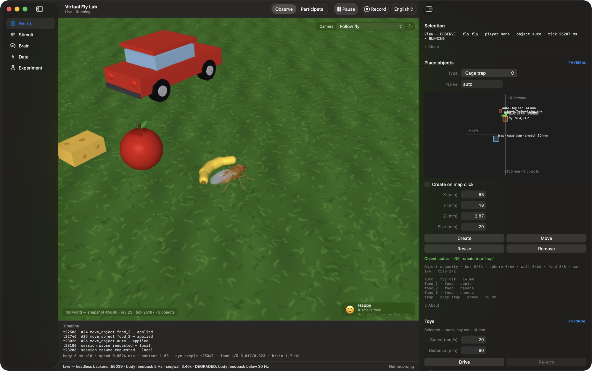
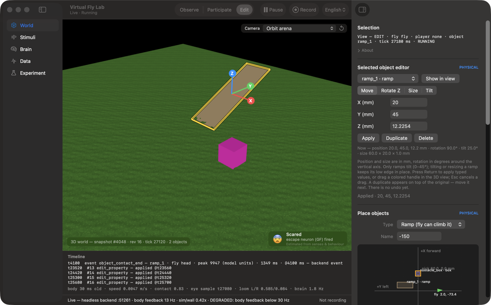
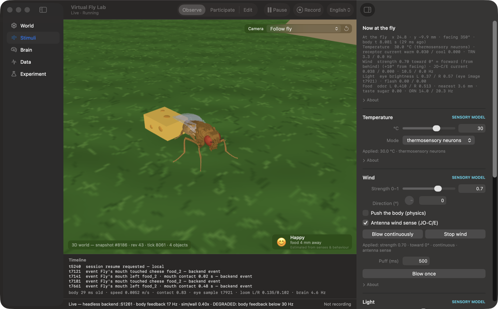
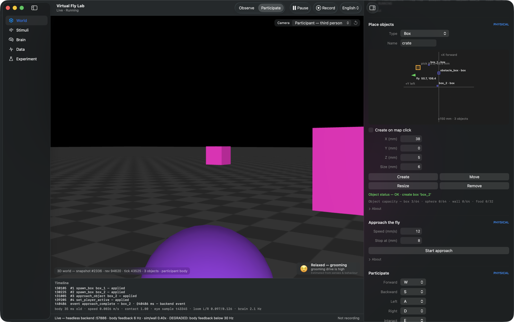
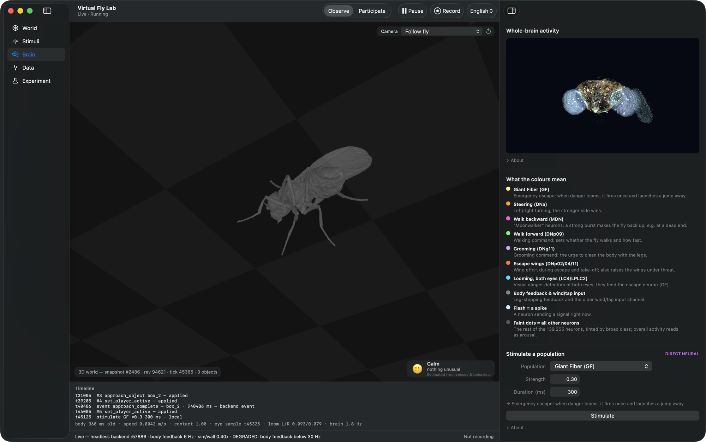
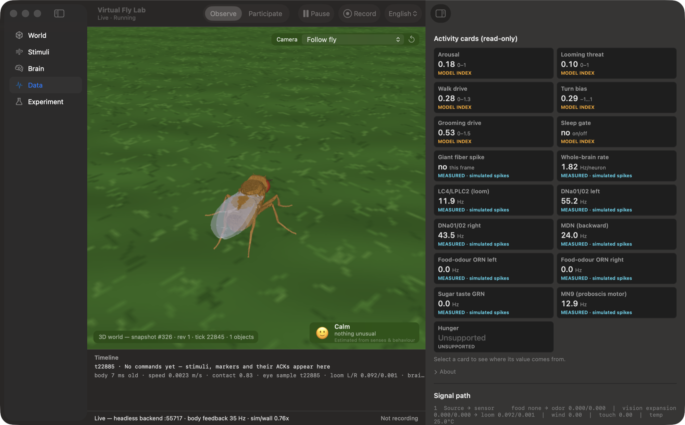
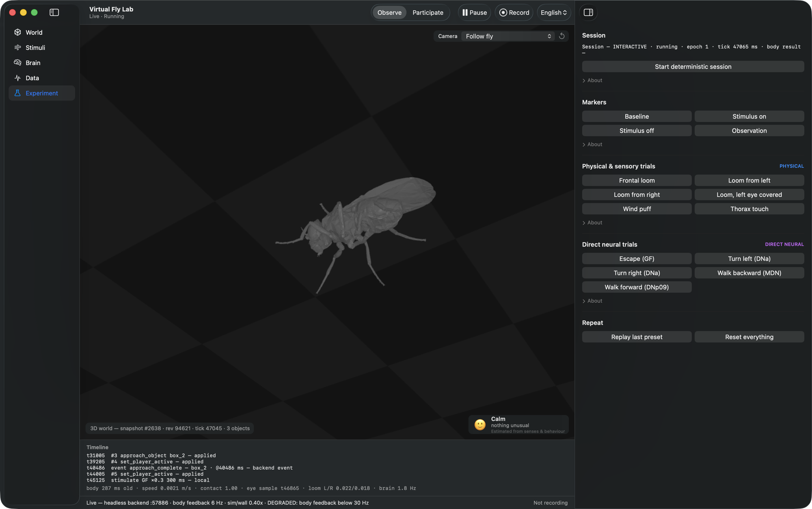
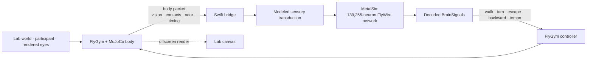

# Thongpari Fly Neuron Sim

<p align="center">
  <strong>A connectome-driven virtual fruit-fly laboratory for macOS.</strong><br>
  The whole FlyWire brain simulated on the GPU, driving a real NeuroMechFly body in MuJoCo — and you can walk into its world.
</p>

<p align="center">
  
  
  
  
</p>

<p align="center">
  
</p>
<p align="center"><sub>The one-window Lab on an M2 MacBook Air, real FlyGym backend. The canvas is MuJoCo's own offscreen render: the colourised NeuroMechFly v2 fly on the 300 mm lawn, walking toward a banana next to cheese, an apple and a toy car. The inspector places physical objects on a top-down map. (The status line flags body feedback below 30 Hz right after a pause/resume; it recovers to about 35 Hz.)</sub></p>

**Thongpari Fly Neuron Sim** grew out of the SiliconFly desktop fly into an interactive **virtual fly lab**:

- **Brain** — the shipped FlyWire v783 connectome as a **139,255-neuron, 15,091,983-edge** leaky-integrate-and-fire network at 1 kHz in a Metal compute shader.
- **Body** — a real **NeuroMechFly v2** model in **FlyGym 2.1 / MuJoCo**, not a scripted animation.
- **Closed loop** — descending-neuron activity drives the FlyGym walking controller; measured body state, rendered-eye vision, contacts, odor, wind and temperature flow back into identified neural populations.
- **You** — a stick-figure participant in the same MuJoCo world: walk with WASD, look with the mouse, pick up and carry objects, and fire a toy BB gun.
- **Sandbox** — a grass lawn, six food models the fly can actually eat (proboscis contact → sugar-taste neurons), a toy car and a cage trap.
- **Editor** — select any object in the 3D view, then move, rotate, resize or duplicate it with typed values or drag handles; add tilted ramps the fly climbs with its own legs.
- **Environment panel** — temperature, continuous wind with a direction dial, per-eye covers and food placement, each showing the value the simulator actually applied and what reaches the fly right now.

The point is not to fake convincing animal behavior. Every response can be traced along **source → modeled sensor → receptor activity → brain output → controller → measured motion**, and every control says whether it is physical, a sensory model, or direct neural stimulation.

---

## Tour

<table>
  <tr>
    <td width="50%"></td>
    <td width="50%"></td>
  </tr>
  <tr>
    <td><b>Edit</b> (V6.3–V6.4) — click an object or pick it from the list, then type values or drag the coloured handles. Here a 60 mm ramp is tilted to 25°; the outline follows the real pose and every change waits for the simulator's ACK. No undo yet.</td>
    <td><b>Environment</b> (V6.5) — the Stimuli page now reads the world at the fly: here it is eating cheese at 30 °C with a continuous antenna-only wind. Applied values and in-flight edits are shown separately.</td>
  </tr>
  <tr>
    <td width="50%"></td>
    <td width="50%"></td>
  </tr>
  <tr>
    <td><b>Participate</b> — a free-joint body that collides with the fly and objects. Walk, look, grab and place from first- or third-person cameras. <i>(Screenshot from V5.6.1; the participant is now a stick figure.)</i></td>
    <td><b>Brain</b> — the whole-brain point cloud with live spike flashes, what each colour means, and direct stimulation of named populations.</td>
  </tr>
  <tr>
    <td></td>
    <td></td>
  </tr>
  <tr>
    <td><b>Data</b> — read-only activity cards (V5.7), then the signal path line by line and live graphs of brain activity, descending populations and sensory drive.</td>
    <td><b>Experiment</b> — deterministic sessions, trial markers, preset physical/sensory and direct-neural trials, CSV recording.</td>
  </tr>
</table>

---

## Status

**V6.1–V6.5 (world editing and the environment panel) are implemented; neither V5 nor V6 is complete.** Each step passed its automated Swift/Python suites, real-MuJoCo tests and real TCP probes ([V6 progress](docs/reports/V6_PROGRESS.md)). At the user's request, V5 GUI/live acceptance and the V6.3/V6.4 GUI checks were deferred while work moved on. A [real-GUI audit on 2026-10-06](notes/validation/gui-2026-10-06/REPORT.md) drove the packaged app and found four defects: the editor dropped a ramp's tilt, food odour used the origin instead of the fly's position, environment errors were overwritten by older replies, and the editor kept English text after a language change. All four are [fixed and covered by new tests](notes/validation/gui-fixes-2026-10-06/README.md); a full GUI re-check is still pending. Undo (V6.6) and scene save (V6.7) are next. The [readiness report](docs/reports/V6_START_READINESS_2026-09-28.md) remains a historical planning assessment, not completion evidence.

| Version | What it added |
|---|---|
| V2 | Closed-loop lab: rendered-eye vision, odor, wind, touch, temperature, presets, recording |
| V3 | Stabilized loop; `SensoryModel` / `MotorReadout` boundaries with frozen V2 oracles |
| V4 | Deterministic sessions: 1 ms neural ticks, exact 20 ms brain/body quanta, pause barriers |
| V5.1–V5.5 | Atomic 3D snapshots and ray picking, Observe/Participate, cameras, a real participant body, WASD / mouse-look input with strict wire validation |
| V5.5.1 | One window: sidebar, MuJoCo canvas, inspector; app-owned headless backend; English/Korean |
| V5.6 | Grab and place: aim, press E to pick up an object, E again to put it down |
| V5.6.1 | Carry and input feel: constrained carry (below), latest-frame video, look-sensitivity slider, pointer lock, test-code refactor |
| **V5.6.2** | Sandbox: stick-figure participant, grass lawn, colourised fly, six food models, feeding with sugar-taste GRNs, toy car, cage trap, BB gun |
| **V5.7** | Read-only activity cards from existing telemetry, each labelled MEASURED, MODEL INDEX or UNSUPPORTED |
| Perf | Bit-identical speed-ups: end-to-end sim/wall 0.44 → 0.70×, canvas 17 → 24 fps |
| V6.1–V6.2 | Backend capability descriptors for every editable property; strict, revision-checked `edit_property` with shared Swift/Python fixtures (rejects instead of clamping) |
| V6.3 | Edit mode: pick objects in the 3D view, move / rotate / resize by numbers or drag handles, duplicate, delete |
| **V6.4** | Ramps: tilted fixed terrain (0–45°) with leg contact pairs, so the fly climbs on its own legs |
| **V6.5** | Environment panel: values at the fly, temperature, continuous wind with a direction dial, per-eye covers, food placement |

Per-version evidence lives in [`docs/reports/V5_PROGRESS.md`](docs/reports/V5_PROGRESS.md), [`docs/reports/V6_PROGRESS.md`](docs/reports/V6_PROGRESS.md) and [`notes/validation/`](notes/validation/v5-6-1-2026-09-27/README.md).

---

## The lab

The Lab is a single standard macOS window: a toolbar (**Observe / Participate / Edit**, pause, record, language), a source-list sidebar, the live world canvas with a timeline and status line beneath it, and an inspector that follows the sidebar. Changing the sidebar page never moves the camera or drops the selection.

| Page | What you can do |
|---|---|
| **World** | Place boxes, spheres, walls, ramps, food, toy cars and cage traps (fields or click-on-map); the selected-object editor in Edit mode; drive a car or re-arm a trap; make an object approach the fly; participant key bindings and look sensitivity; resets |
| **Stimuli** | The environment panel: live values at the fly, temperature and its mode, wind (physical force and/or modeled antennal drive, continuous or one puff), per-eye covers and flashes, food in front of the fly, touch thorax/head/abdomen/legs |
| **Brain** | Whole-brain point cloud, neuron selection, direct stimulation of GF, DNa, MDN, DNp09, DNg11, LC4/LPLC2 and the exposed receptor groups |
| **Data** | Activity cards; source state, receptor drive and spike rates, decoded `BrainSignals`, controller output, packet age, sim/wall timing, measured motion |
| **Experiment** | Deterministic session, markers, looming/wind/touch/direct-neural presets, replay, recording |

Every control is labeled with the kind of intervention it is:

- **PHYSICAL** — real MuJoCo geometry or force.
- **SENSORY-MODEL** — an explicit engineering transduction into identified neural populations.
- **DIRECT-NEURAL** — current injection that bypasses sensory transduction.

A physical touch on the left front leg is a body-specific MuJoCo event; the neural touch path is a **generic modeled startle channel**. The UI never presents those as the same thing.

### Participate: walk, look, grab, place

Choose **Participate**, then click the 3D view to take control. The cursor hides and stays put so mouse-look keeps working past the window edge.

| Input | Action |
|---|---|
| **W A S D** | walk (remappable on the World page) |
| **Mouse** | look; speed on the **Look sensitivity** slider (default 0.0015 rad/pt, saved) |
| **E** | grab the object under the center mark (within 16 mm); press again to place it |
| **G / F** | equip the toy BB gun / fire along the view direction (a click also fires while it is equipped) |
| **Esc** | release control; focus loss, mode change and window close release it too |

Movement is integrated in **simulation time**, not frame rate or key repeat. Mouse-look deltas are applied exactly once however the OS splits the events.

**Carrying** is kinematic and XY-only at up to 40 mm/s, held just in front of where you look. Since V5.6.1 each 0.1 ms physics substep is constrained *before* it is taken: MuJoCo's signed distance and witness points give the surface normal and remaining gap to nearby objects and to your own body, and the step keeps only what every surface allows. A held box therefore slides along walls and swings around you instead of pushing into you. It keeps 0.5 mm from the participant and stops 0.005 mm short of other objects. The older approaches — straight chase, polar sweep, tangent slide — each shoved the participant (up to 32.5 mm) or stuck against walls in real-MuJoCo tests. A post-step guard still reverts any step that deepens a penetration.

### Edit: select, move, rotate, resize, tilt

Choose **Edit**, then click an object in the 3D view or pick it from the list; **Show in view** turns the orbit camera to it. The tools are **Move**, **Rotate Z**, **Size** and, for ramps only, **Tilt**. Type a value and press Return, or drag a coloured handle; Esc cancels a drag. Out-of-range values are refused before anything is sent. Every edit carries the object's revision, so an edit made against an older state is rejected rather than applied over someone else's change, and the field shows the value the simulator reports back. **Duplicate** and **Delete** use the same path; a full slot pool is reported in words. There is no undo yet (V6.6).

**Ramps** are fixed terrain: a thin box tilted 0–45° about its own Y axis. Tilting or resizing keeps the low edge in place, and they cannot be grabbed. FlyGym's fly geoms do not collide with anything by default, so every ramp slot gets explicit contact pairs for the tibiae, tarsi and body, with the floor's friction and solver settings. In real MuJoCo the fly climbs a ramp on its own legs (thorax height 1.0 → 7.4 mm); without those pairs its legs pass through. The cost: about +2% per step when ramps are far away, about +45% while the fly stands on one (mesh–box collision).

### Environment panel

The Stimuli page starts with **Now at the fly**: the latest body packet (position, heading) and what each modeled sensor reports there — temperature and thermosensory current, wind relative to the fly's heading and JO-C/E current, eye brightness, odour and nearest food, sugar taste. Below it, each setting shows the **applied** value from the simulator separately from an edit that is still on its way. A fast slider drag sends a bounded number of edits and ends on the last value. Wind can blow continuously at a set strength and direction, with the body push and the antennal sense switched on separately; changing it while a timed puff runs is rejected until the puff ends or you press Stop.

### Sandbox: food, feeding, toys

- **Lawn and fly.** The FlyGym floor is textured as a 300 × 300 mm lawn (collision is unchanged), and the fly uses NeuroMechFly's own colourised materials.
- **Food.** Apple, banana, cheese, grapes, cookie and sugar cube, cycling on each spawn. Food can be carried to lure the fly; the odour model is unchanged.
- **Feeding.** When the proboscis tip (`c_haustellum`) touches food, the food shrinks and disappears (`feeding_begin`, `feeding_end`, `food_eaten`). While eating, `taste_sugar` drives the **21 left-labellum sugar GRNs** from the v783 list (eonsystemspbc/fly-brain `a3db62f9`); MN9 is shown read-only. The current gain and per-food sugar are model assumptions. There is no reward, hunger or scripted approach — odour alone produces no taste signal.
- **Toys.** A toy car drives straight and stops on contact (`car_hit_fly`); a glass cage trap drops only when the fly is fully underneath; the BB gun fires real-gravity pellets aimed at the ray hit under the center mark. The trajectory line is in a geom group the fly's eyes never render. Any fly response comes from physics and the existing sensory paths.

The default fixed-topology object pools support **64 boxes, 64 spheres, 64 walls, 8 food objects, 4 cars and 2 traps** at once (mock and real backends). Food and toys have multi-part geometry, so their smaller pools limit idle MuJoCo cost. Spawning beyond a shape's capacity is rejected without changing the world; deleting an object releases its slot for reuse. These are preallocated defaults, not dynamically growing pools.

### Activity cards

The Data page opens with 17 read-only cards. **MEASURED** cards are spike rates or events of the simulated connectome (not a real fly); **MODEL INDEX** cards are the readouts that drive the body model; **Hunger** is shown as **UNSUPPORTED** because it is not modelled. Clicking a card only shows where its value comes from; it never stimulates or commands anything.

---

## Closed-loop architecture


```mermaid
flowchart LR
    W[Lab world · participant · rendered eyes] --> P[FlyGym + MuJoCo body]
    P -->|body packet\nvision · contacts · odor · timing| B[Swift bridge]
    B --> S[Modeled sensory transduction]
    S --> M[MetalSim\n139,255-neuron FlyWire network]
    M --> D[Decoded BrainSignals]
    D -->|walk · turn · escape · backward · tempo| C[FlyGym controller]
    C --> P
    P -. offscreen render .-> V[Lab canvas]
```

- Swift owns the brain (Metal) and the UI.
- Python owns the body, world and participant physics (FlyGym / MuJoCo).
- They talk NDJSON over a loopback socket with session/epoch/tick stamps, bounded queues and freshness checks. Stale body feedback is rejected, never replayed as current sensory state.
- The canvas shows MuJoCo's own render of the same `MjModel`/`MjData`, the physics thread only updates the scene and the GPU render runs on its own thread (rendering on the physics thread had cut body rate from 24 to 12–17 Hz).

---

## What you can test

- **Vision and looming** — real left/right FlyGym eye renders; brightness, occupancy and a generic optic-expansion estimate. Regression tests reject contraction, camera pan and full-field flash as false looms.
- **Food / odor** — food sources are physical markers with a modeled odor plume. Concentration from source geometry and fly pose is split bilaterally into FlyWire `ORN_DM1` + `ORN_VA2`. No taste, reward or scripted food-seeking.
- **Wind** — independently a physical force on the thorax and/or modeled drive into `JO-C*` / `JO-E*`.
- **Touch** — a real impulse to the thorax, head, abdomen or any named leg; the neural side is a labeled generic startle channel.
- **Temperature** — `environment_only`, `modeled_physiology` (locomotor tempo through the real controller), or `flywire_sensory` (`TRN_VP2`, `TRN_VP3a`, `TRN_VP3b`).
- **Direct neural** — stimulate a named population and watch what the body does with it.

---

## Quick start

**Requirements:** an Apple Silicon Mac, Xcode Command Line Tools (Swift), Python 3.12, and FlyGym 2.1.0 with its MuJoCo dependencies.

```sh
git clone https://github.com/parkjaeyoungcovid19-hue/thongpari-fly-neuron-sim.git
cd thongpari-fly-neuron-sim
./build.sh

/opt/homebrew/opt/python@3.12/bin/python3.12 -m venv flygym-venv
./flygym-venv/bin/pip install -r flygym_bridge/requirements.txt
```

Launch the Lab by double-clicking **`Virtual Fly Lab.command`** in Finder, or:

```sh
./run_flygym.sh
```

The launcher rebuilds when a Swift source is newer than the binary, then runs `./ThongpariFlyNeuronSim --lab`. The app starts its own headless FlyGym/MuJoCo backend on a private loopback port, shows it in the one window and stops it on quit. The backend also exits by itself if the app dies. A cold start takes a while to prewarm, and the window shows progress until it is ready.

| Command | Use |
|---|---|
| `./package_app.sh` | build `dist/Thongpari Virtual Fly Lab.app` from this checkout |
| `./run_flygym.sh --mock` | kinematic mock body, no MuJoCo — quick UI checks |
| `./run_flygym.sh --viewer` | development only: also opens MuJoCo's own viewer |
| `./run_flygym.sh --bridge-only` | just a headless bridge on `127.0.0.1:17841` for the TCP diagnostics |
| `./ThongpariFlyNeuronSim` | the original desktop-overlay fly with its brain window |

If macOS "Optimize Mac Storage" has offloaded `flygym-venv` to iCloud, the first backend start downloads each Python file on demand and can take many minutes. Keep the project folder downloaded.

**Performance.** On the 8 GB M2 MacBook Air in the screenshots, the full real body with the render stream now runs at about **0.7× real time** with ~35 Hz body feedback and a 24 fps canvas (it was ~0.44× / 17 fps before the 2026-09-29 pass). Every change in that pass was checked to leave physics bit-identical (qpos/qvel hashes over 90 intervals). The remaining cost is MuJoCo's own step (~74%) and the FlyGym controller; going further would change timestep or solver. When feedback drops below 30 Hz the status line says `DEGRADED` rather than hiding it. These are machine-specific observations, not benchmarks. Details: [`V5_PROGRESS.md`](docs/reports/V5_PROGRESS.md). With the V6 features the picture is not settled: the 2026-10-06 GUI audit saw 19–23 Hz body feedback on battery power, and the AC-power measurement has not been redone since V6.4–V6.5 (a headless TCP run measured 38.3 Hz on AC after V6.1).

---

## Recording experiments

```text
~/Documents/ThongpariFlyNeuronSimExperiments/experiment-YYYYMMDD-HHMMSS/
├── metadata.json
├── events.jsonl
└── telemetry.csv
```

Telemetry includes neural rates, modeled sensory drive, receptor spike rates, decoded brain state, controller output, body velocity and contacts, vision values, packet age and simulation timing. `Baseline`, `Stimulus ON/OFF` and `Observation` markers make repeated trials comparable.

---

## Testing

Self-tests are built into the binary; Python tests run against the mock and the real MuJoCo body.

```sh
./build.sh
./ThongpariFlyNeuronSim --labtest        # lab protocol, input, frame hand-off
./ThongpariFlyNeuronSim --bridgetest     # wire contract and decoders
./ThongpariFlyNeuronSim --v4test         # deterministic sessions
./ThongpariFlyNeuronSim --worldeditortest # editor, ramps, environment panel (headless AppKit)
./ThongpariFlyNeuronSim --v4timingtest
./ThongpariFlyNeuronSim --simtest        # circuit invariants + GPU throughput
./ThongpariFlyNeuronSim --behaviortest   # sim -> body end to end
./ThongpariFlyNeuronSim --gpucheck       # GPU vs an independent CPU reference

./flygym-venv/bin/python flygym_bridge/test_v5_6_2.py --mock-only # food capacity / lifecycle, no MuJoCo
./flygym-venv/bin/python flygym_bridge/test_interaction_real.py   # grab / carry in real MuJoCo
./flygym-venv/bin/python flygym_bridge/test_player_collision_real.py
./flygym-venv/bin/python flygym_bridge/test_lab_real.py
./flygym-venv/bin/python flygym_bridge/test_environment_edits.py  # shared edit fixtures
./flygym-venv/bin/python flygym_bridge/test_v6_4_terrain_real.py  # the fly climbs a ramp in real MuJoCo
```

Against a fresh backend (`./run_flygym.sh --bridge-only`, or `bridge.py --mock`), `--bridgeloop`, `--labloop`, `--v4loop` and `--interactionloop` exercise the real TCP path. `--inputprobe` measures input latency and look cadence, and exits non-zero if its preconditions fail.

Historical independent run (2026-09-29): 17 commands passed and 2 failed: the stale [real Lab capacity check](<flygym_bridge/test_lab_real.py>) and the real-headless TCP body-rate gate (14.1 Hz < 30 Hz). That run was not a complete V5/performance pass. Details: [2026-09-29 validation](<notes/validation/v5-independent-2026-09-29/README.md>). New suites: [sandbox and feeding tests](<flygym_bridge/test_v5_6_2.py>), [toy tests](<flygym_bridge/test_v5_6_2_tools.py>).

Focused capacity recheck (2026-10-05): corrected the stale `food >= 32` test expectation to the approved default of 8, without changing runtime pools. Added mock and real checks for exhaustion, rejection without state changes, deletion and slot reuse; real checks also inspect MuJoCo geometry activation and cleanup. Six mock/contract Python suites passed **236 checks**; the real headless Lab suite passed **68 checks**, with no failures. Swift, GUI, TCP-loop and performance validation were not rerun in that focused test/documentation-only pass. Subsequent [2026-10-05 V5 closure revalidation](<notes/validation/v5-next-2026-10-05/README.md>) includes the feeding deletion fix, pause-help correction, build, seven Swift suites, twelve Python suites and a fresh real-headless TCP pass; GUI/live-rendering acceptance remains pending.

---

## What is measured, what is modeled

**Grounded in data or runtime state:** FlyWire v783 identities and connectivity; FlyGym/MuJoCo body state and contacts; rendered eye frames; bridge timing and controller output; the spikes the simulation actually produces after an input is injected.

**Engineering assumptions:** odor → current gain; temperature → TRN current; wind → JO-C/E current; the generic touch/startle channel; the optic-expansion estimator; the descending-neuron → locomotor-controller mapping.

Use it for **controlled comparisons inside the same model**, not as a claim that every intermediate quantity is a measured biological transfer function.

---

## Repository map

```text
.
├── Virtual Fly Lab.command        Finder launcher (runs run_flygym.sh)
├── run_flygym.sh / package_app.sh CLI launcher / app bundle builder
├── main.swift                     launch modes, Coordinator (brain ↔ body loop), AppDelegate
├── MetalSim.swift, LIF.metal      GPU FlyWire spiking simulation
├── SensoryModel.swift             modeled source → receptor drive
├── MotorReadout.swift             population rates → BrainSignals
├── FlyGymService.swift            app-owned backend process on a private port
├── FlyGymBridge.swift             TCP transport, queues, connection lifecycle
├── FlyGymPackets.swift, LabProtocol.swift   wire packets and lab telemetry types
├── LabWindow.swift, LabChrome.swift         the Lab window, sidebar, inspector pages
├── WorldViewer.swift, MuJoCoCanvas.swift    3D canvas: camera, picking, participate input, MuJoCo frames
├── WorldEditor.swift              Edit mode: selected-object editor, handles, ACK bookkeeping
├── EnvironmentProperty.swift      capability descriptors and revision-checked edits
├── EnvironmentPanel.swift         the environment panel (Stimuli page)
├── PlayerController.swift         WASD / mouse-look / focus / remap / look sensitivity
├── BrainView.swift                139k-neuron point cloud (Brain page)
├── ActivityCards.swift            read-only activity cards (Data page)
├── ExperimentRecorder.swift       events + CSV recording
├── LabLocalization.swift          English / Korean strings
├── LabDiagnostics.swift           --labtest
├── SimDiagnostics.swift           --simtest / --behaviortest / --v4timingtest
├── BridgeDiagnostics.swift        --bridgetest and the live TCP loops, --inputprobe
├── WorldEditorDiagnostics.swift, EnvironmentPanelDiagnostics.swift   --worldeditortest
├── flygym_bridge/
│   ├── bridge.py                  Python server (sessions, commands, input, snapshots)
│   ├── fly_body.py                mock + real FlyGym body
│   ├── lab_world.py               world objects, ramps, stimuli, carry constraints
│   ├── environment_properties.py  capability descriptors and edit validation
│   ├── interaction.py             grab / place contract and constrained carry step
│   ├── player_body.py             participant (stick figure) physics and movement
│   ├── sandbox_models.py          food, car, trap, BB and stick-figure models from MuJoCo primitives
│   ├── view_stream.py             MuJoCo offscreen render stream for the canvas
│   ├── vision_decoder.py          rendered-eye decoder
│   └── test_*.py                  Python regression suite
├── data/                          FlyWire v783 connectome (~95 MB, CC BY-NC 4.0)
└── docs/                          guides, plans + roadmap, reports, reference
```

Controls and preset values: **[Virtual Fly Lab guide](docs/guides/VIRTUAL_FLY_LAB_GUIDE.md)**. Bridge internals and protocol: **[flygym_bridge/README.md](flygym_bridge/README.md)**. The **[V4–V14 roadmap](docs/plans/VIRTUAL_FLY_LAB_ROADMAP.md)** normally proceeds in order; the documented user exception starts V6.1 while deferring V5 GUI/live acceptance. V6.1–V6.5 are implemented with GUI checks pending; V6.6–V14 remain planned. Sandbox contract: **[V5.6.2 spec](docs/plans/VIRTUAL_FLY_LAB_V5_6_2_SANDBOX_SPEC.md)**.

---

## Upstream work and credits

This repository started from **[SiliconFly](https://github.com/dawsonamf/siliconfly)** by Dawson Metzger-Fleetwood, which credits **[DesktopFly](https://github.com/DenisSergeevitch/desktop-fly)** by Denis Shiryaev for the original desktop fly. It also builds on:

- **[FlyWire](https://codex.flywire.ai/)** connectome data;
- **[FlyGym / NeuroMechFly v2](https://neuromechfly.org/)** by the Ramdya Lab, EPFL;
- **[MuJoCo](https://mujoco.org/)** for physics and rendering.

Please cite the relevant upstream projects and papers when using their data or models in research.

<p align="center">
  
  
</p>

- `docs/images/neuromechfly-v2.jpg` — simulated NeuroMechFly v2 scene, **Ramdya laboratory, EPFL**, **CC BY-SA 4.0**: <https://actu.epfl.ch/news/simulating-how-fruit-flies-see-smell-and-navigat-4>.
- `docs/images/drosophila-melanogaster.jpg` — *Drosophila melanogaster* by **Alexis** (`alexis_orion` on iNaturalist), **CC BY 4.0**, Wikimedia Commons: <https://commons.wikimedia.org/wiki/File:Drosophila_melanogaster_53362116.jpg>.
- `docs/images/ui-*.png` — screenshots of this app: `ui-edit.png` and `ui-environment.png` captured 2026-10-07 (real backend, AC power; body feedback was 5–21 Hz while the app was driven by accessibility scripting, so the status line reads `DEGRADED`), `ui-world.png` and `ui-data.png` 2026-09-30, the others 2026-09-27.

---

## License

Source code is MIT-licensed; see [LICENSE](LICENSE). Connectome-derived data under `data/` is licensed separately (CC BY-NC 4.0); see `data/DATA_LICENSE.md`.
